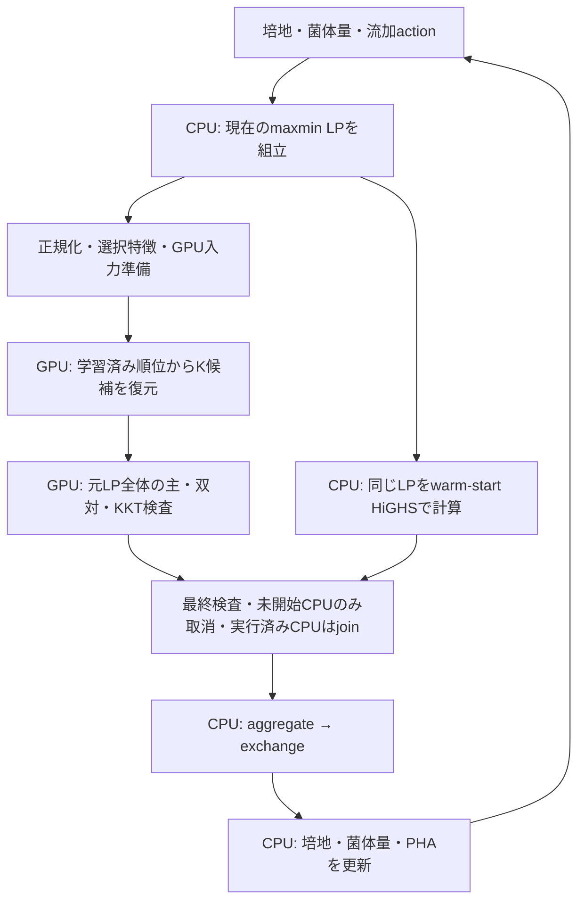

# dFBAデータフローと計算律速の調査

## 計測の意味

OR16 + NS21 + P. freudenreichiiの3種モデルについて、1物理step=0.2h、1環境・1stepにつきmaxmin/aggregate/exchangeの3 LPを解く。ここで測る8stepは培養1.6hに相当する数値シミュレーションであり、PPOの8回の重み更新や学習完了時間ではない。32環境×8step=256環境step、768 LPを1組とし、2組なら1,536 LPがCPU参照の仕事量である。

比較は同じGEM・初期seed・流加action・物理積分・元LP・辞書96候補・MLPを使用。CPU対照はpersistent HiGHSの4 workers、各LPは1 thread、有効warm basisを優先。GPU併用にも同じCPU経路を残す。計測wallには入力準備・転送・GPU初回graph構築・同期・全CPU workerのjoinを含め、環境作成は含めない。router setupは別field。未使用になったCPU計算も実際のCPU実行数へ計上する。

## データ処理フロー

次図はCPUを先行・並行実行するspeculative構成（今回の実験1–3）のフローである。実験4のGPU-first構成では、元LP認証に不合格だったLPだけをCPUへ渡し、CPUとの重複計算をしない。

独立環境は並列に扱うが、同一環境の3段階・次時点は逐次依存する。現在のpipelineはmaxminで環境群のbarrierを設け、その後aggregate/exchangeをCPU workerで処理する。主threadはCOBRAの入力組立と状態更新を担う。更新前の解をそのまま次stepに流用してよいわけではない。

新しいafter-submit設定では、GPUへの仕事の投入後にFのCPU準備/dispatchを始める。これは処理順の変更であり、GPU認証前にCPU結果を不要と判定する方式ではない。GPUとCPUが重なる区間の秒数を足し合わせて総wallと解釈しない。

## 発見した律速と対応

| 項目 | 根拠 | 今回の対応 |
|---|---|---|
| 後段CPU処理が大きい | 従来32×8×2のCPU非重複wallで後段CPU待ち54.3%、主thread再開19.5%、CPU準備9.9%。maxminは16.0% | GPUだけが律速という説明を撤回。全体wallと段階別会計で判断 |
| 過去候補の無条件優先 | 固定の独立入力4×120でlearned K1認証193件が、因果previous-firstでは147件に減少 | `within-budget`: 現在のtop-K内にある過去候補だけを優先 |
| 使わないGPU診断も計算 | 補正なし経路では分散、違反個数/L1、補正用scoreを使わない | `certificate-only`: 全元LP認証/family guardを残し未使用診断を省略 |
| 小さなGPU↔CPU同期の反復 | 単独rank約1.5msに対しCPU並行時14–29ms。結果完了/転送/検査に34–39ms | 順位はGPU内に保持。特徴・標準化・hidden・logitのfinite maskを最終認証へAND。7回の結果downloadをFP64の1回へ集約 |
| CPU並行時のGPU準備時間増加（原因未同定） | 単独normalize約15msに対し並行時約32–44ms、初回約509ms。ただし入力・実行条件も異なる | GPU投入後にCPU準備/dispatchを行うopt-in。GIL・CPU帯域/スケジューリング・GPU待ちなどの寄与は未分離。採否は総時間で判断 |
| bounds/CSRの反復処理 | `_problem`、`lp_arrays`、workerで再解析。trace ndarrayのPython unpackingが高費用 | numeric boundsのベクトル化。immutable共有LP snapshotは設計監査までで未実装 |

## 部分処理の実測

`pf_dataflow_profile32_20260905.json`: 開発評価trace先頭32 LP（1軌跡内の異なる時刻）の入力だけを再生し、CPU参照解はrank前に破棄した。実環境32個の閉ループ速度ではない。初回構築を分離しwarm 12回の中央値を比較した。

| GPU検査 | 通常 (ms) | 必須認証のみ (ms) | 時間削減 |
|---|---:|---:|---:|
| K=1 | 3.237 | 2.884 | 10.9% |
| K=4 | 10.884 | 9.373 | 13.9% |

受理maskは一致、受理解・目的値・元LP残差・候補IDはbitwise一致。GPU使用率を上げるための無用な負荷は追加していない。

初回profileのboundsは再生用numeric ndarrayで、32 LPのGPU側parse中央値238.7ms。live環境のlist-of-pairsとは異なるため、この値をそのまま実環境の律速割合にしない。bounds高速化は特にtrace再生を改善するもので、live GPU adapterのlist処理は旧動作を維持する。

最終コードの[再測定](../results/pf_dataflow_profile32_final_20260905.json)も完了した。同じ入力再生における32 LP合計のparse中央値は、ndarray形式でCPU 7.70ms/GPU adapter 3.52ms、list-of-pairs形式でCPU 40.07ms/GPU adapter 35.49msだった。後者も入力再生であり、並列環境を動かしながら測った値ではない。GPU必須認証のみの再測定はK1 3.191→2.904ms、K4 12.155→9.364msで、受理maskと受理解・認証値のbitwise一致を再確認した。これはmicrobenchmarkでの短縮であり、以下の全体時間と混同しない。

## 閉ループ結果

全LPでprimal∞≤1e-5、dual違反≤1e-7、relative KKT gap≤1e-7を要求。終点PHA相対≤1%、菌体量最大絶対≤0.01g/L、PHV分率絶対≤0.01を要求。CPU合意は培養モデルの実験的妥当性を意味しない。

4構成とも32環境×8step×2組を完了した。各構成で同じ64評価seedとactionを使い、1組目はCPU→GPU併用、2組目はGPU併用→CPUの順で実行した。初回graph構築を含む実時間の合計を示す。「GPU併用」は完全GPU内完結ではない。

| 実験 | 構成 | CPU単体 (s) | GPU併用 (s) | GPU併用の時間増減 | GPU認証 / 512 maxmin LP | 実行したCPU LP / 1,536 |
|---|---|---:|---:|---:|---:|---:|
| 1 | K1・必須認証のみ・従来転送/dispatch | 56.3065 | 57.1364 | +1.47% | 138 | 1,463 |
| 2 | K4・GPU内順位・集約転送・GPU投入後にCPU開始 | 59.6479 | 59.7026 | +0.09% | 225 | 1,381 |
| 3 | 実験2 + 転送配列のpackingもCPU開始前へ移動 | 61.9098 | 62.4974 | +0.95% | 225 | 1,366 |
| 4 | K4・GPU認証後、不合格LPだけCPU計算 | 59.9879 | 61.6430 | +2.76% | 225 | 1,311 |

CPUに最も近かった実験2も、合計では0.0547秒遅く、CPU超えは未達である。K1→K4でGPU認証は27.0%→43.9%となったが、全LPのうちGPUで受理されたのはK4でも225/1,536=14.6%に留まる。aggregate/exchangeはすべてCPUで実行した。実験4は重複CPU計算をなくしたが、全体は速くならなかった。

| 実験 | 1組目 CPU / GPU併用 (s) | 2組目 CPU / GPU併用 (s) | 認証後に未開始CPUを取消 | 実行済みだが未使用のCPU LP |
|---|---:|---:|---:|---:|
| 1 | 28.1139 / 29.0587 | 28.1926 / 28.0776 | 73 | 65 |
| 2 | 29.4009 / 30.1489 | 30.2470 / 29.5537 | 155 | 70 |
| 3 | 33.0960 / 34.0174 | 28.8138 / 28.4800 | 170 | 55 |
| 4 | 29.4076 / 30.8500 | 30.5804 / 30.7930 | 0 | 0 |

各構成2組のみで、seed群・実行順・初回構築の影響を分離した反復実験ではない。特定の組だけを選んで速度優位とせず、信頼区間や統計的有意差を主張しない。実験間でCPU時間自体も変動しているため、別実験のCPU時間とGPU時間を組み合わせて倍率を算出しない。実験4はfull diagnostic経路とCPU fallbackのGPU由来basis initializerも異なり、dispatchだけの一要因比較ではない。

全実験で元LP認証・終点ゲートを通過し、CPUとの終点差はPHA・菌体量・PHV分率とも報告値0、数値再試行0だった。GPU併用maxminの最大primal残差は9.9250e-6で、閾値1e-5の範囲内だがゼロではない。終点差0を「GPU解の誤差0」や「全時点の軌跡一致」とは解釈しない。受理されなかったGPU候補はCPUへ戻し、未認証解では状態を更新していない。厳しい認証を維持した短い閉ループ試験の結果であり、120step全区間や実培養の妥当性の証明ではない。

### 何が改善し、何が残ったか

実験1→2でwarm中央値のGPU順位処理は19.21→1.78ms、正規化は37.48→15.15msへ短縮した。一方、結果完了・転送・host検査をまとめた区間は35.90→139.63msへ増加し、実験3でpackingを前倒ししても136.79msが残った。これらはhost観測区間で、CPU処理との重複もある。GPU演算そのものやPCIe転送だけの時間とは解釈しない。互換性のため残した`bank_seconds`にもafter-submit時はCPU準備/dispatchが含まれる。

最も総時間の近かった実験2でも、CPU対照59.6479秒のうち後段CPU完了待ちは33.1022秒（55.5%）、主thread再開は12.0720秒（20.2%）、CPU準備は5.4602秒（9.2%）、maxminは8.8426秒（14.8%）だった。GPU併用のmaxmin区間は8.3299秒へ約5.8%短縮したが、その局所改善は全体の短縮に至らなかった。後段CPU futureの完了待ちが計測上の最大区間であり、CPU使用率やHiGHSの純粋なsolve時間と同義ではない。worker側入力解析・候補準備・queue/scheduling・並列完了待ちなども含み得る。

現在の主な問題は「GPUの候補検査が遅い」ことだけではなく、GPU対象が第1段階に限られることと、後段CPU処理・入力組立・同期を含む処理全体である。したがって、候補を際限なく増やす前に、元LP入力の一度だけの解析と共有、後段aggregate/exchangeの詳細計測・GPU適用を優先する。

検証済みの全結果・実行数・非重複時間・source snapshot照合は[機械可読集計](../results/pf_dataflow_all_experiments_summary_20260905.json)に保存した。個別結果は[実験1](../results/pf_dataflow_k1_32x8_20260905.json)、[実験2](../results/pf_dataflow_async_k4_32x8_20260905.json)、[実験3](../results/pf_dataflow_prepacked_k4_32x8_20260905.json)、[実験4](../results/pf_dataflow_gpu_first_k4_32x8_20260905.json)を参照。

## 再現性と残る課題

- 元bank/MLP/GEMは変更・再学習していない。SHA固定、評価seed20297001–64は学習seedと分離した開発評価条件。
- `pf_dataflow_smoke4x3_20260905.json`はhelper source freeze中の競合が後から分かったため、性能根拠には使用しない。保存済みsnapshotは書き換えていない。次の32環境runではhelperの保存snapshotとsource SHA一致を確認した。
- 正しい入力を1回だけ検証してCPU/GPUへ共有するsnapshot APIは、所有権・CSR/配列の不変性・options/basisのdeep copy・queue/resetの安全性を伴う設計が必要。単なるmutable cache追加では誤ったLPを解くリスクがあるため保留。
- 監査で、CPU backendの動的options変更/削除時の復元処理に課題を発見した。ここで比較したcommunity optionsは固定のため既知の影響はないが、任意optionsをstepごとに変更する将来APIでは解消が必要。
- 120step全区間の長時間閉ループ、PPO全体、全3段階のGPU内完結の達成を、短い入力再生や8step試験から主張しない。
- PPO既定は変更せず、全新方式は明示flagを使う実験経路。
- 最新コードの回帰テストはGPU/CPU・community/pipeline関連968件、分離実行した時系列/圧縮/coverage router関連171件、計1,139件が合格した。通常経路とのGPU受理解同値、入力の非有限値の拒否、取消/join、GPU投入後例外のstream drainも確認した。例外時drainの補強は実験3完了後の変更であり、正常系の計測source snapshotは書き換えていない。

更新した次段階の方針は[改善計画 Revision 5](DATAFLOW_ACCELERATION_PLAN_20260905.md)に記載した。

設計参考: [NVIDIA CUDA Best Practices](https://docs.nvidia.com/cuda/cuda-c-best-practices-guide/)。同期/転送の集約という一般的設計指針であり、本系の性能倍率の出典ではない。
