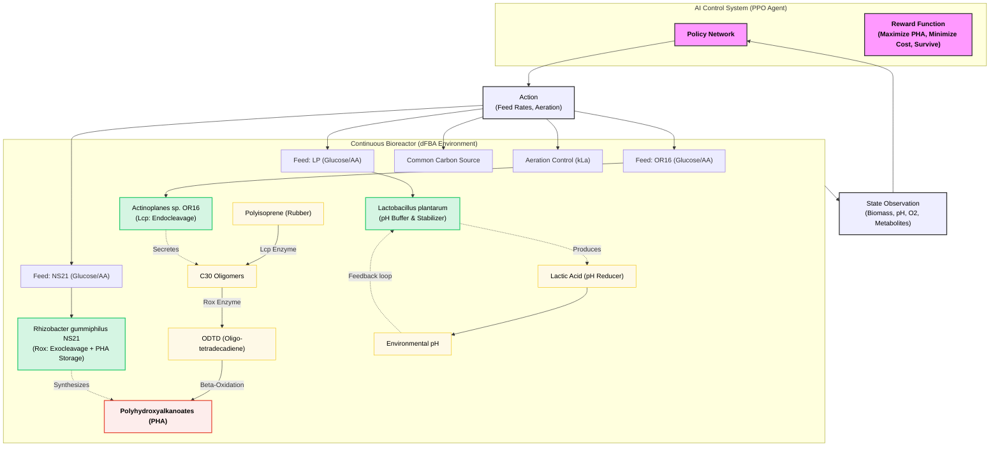

# Figure 1: AI-Driven Microbial Consortium for Rubber Degradation and PHA Synthesis

This conceptual diagram illustrates the integration of Reinforcement Learning (RL) with a genetically engineered three-species microbial consortium (Actinoplanes sp. OR16, Rhizobacter gummiphilus NS21, and Lactobacillus plantarum). 

**Caption:** 
**(A)** The Bioreactor environment simulates the dynamics of three interdependent bacterial species using dynamic Flux Balance Analysis (dFBA). *Actinoplanes sp. OR16* initiates rubber degradation by secreting Lcp, producing C30 oligomers. *Rhizobacter gummiphilus NS21* further breaks down these oligomers into ODTD and utilizes the carbon flux to accumulate Polyhydroxyalkanoates (PHA). *Lactobacillus plantarum* acts as a metabolic buffer, secreting lactic acid to counter the pH increases caused by rubber degradation. 
**(B)** The Proximal Policy Optimization (PPO) agent observes the real-time internal state of the bioreactor (biomass concentrations, pH, and metabolite levels) and continuously outputs actions (specific feed rates and aeration) to maximize PHA production while maintaining consortium survival and minimizing resource costs over a 28-day cycle.
